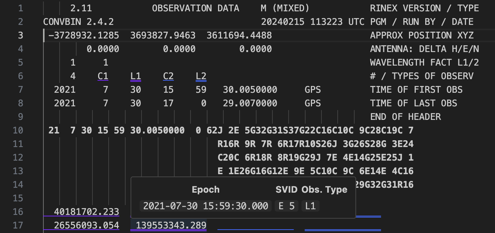
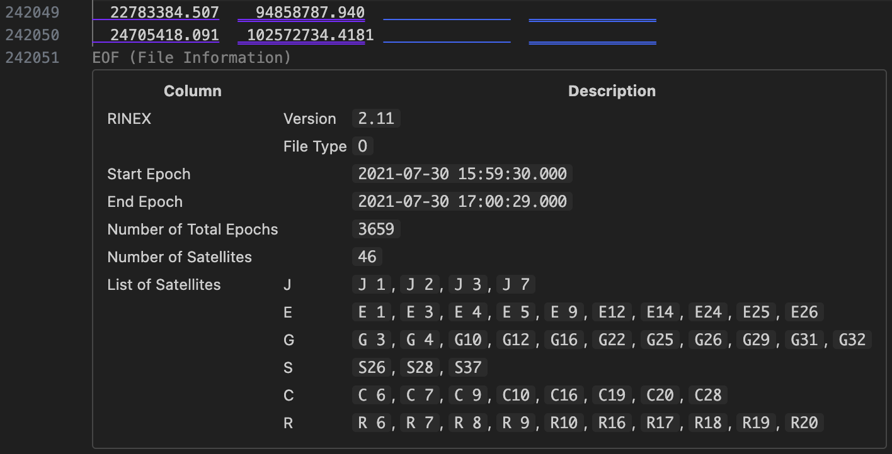

# rinex-viewer README

"rinex-viewer" is a viewer designed to enhance the readability of Receiver INdependent EXchange (RINEX) files.

## Features

* Visualization of data from RINEX Observation Data Files, making ASCII files easier to read, including satellites, epochs, and observation types.

  

    
Header and body:

    
  

  

    
EOF:

    
  

## Supported Format Version

* RINEX Observation Data Files
  * Versions: 2.11, 3.0x
  * Extensions: `.YYo`, `.obs` and `.rxo`

## Release Notes

### 1.0.0　(2024-02-15)

#### New feature
- Visualize RINEX Observation file
- Support versions: 2.11, 3.0x
- Support extensions: `.YYo`, `.obs` and `.rxo`

## License

This project is licensed under the MIT License. See the [LICENSE](LICENSE) file for more information.
